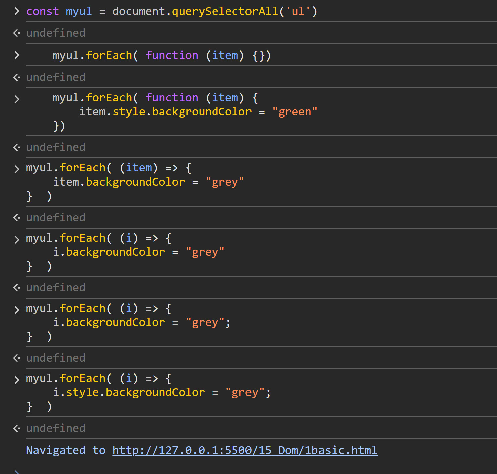
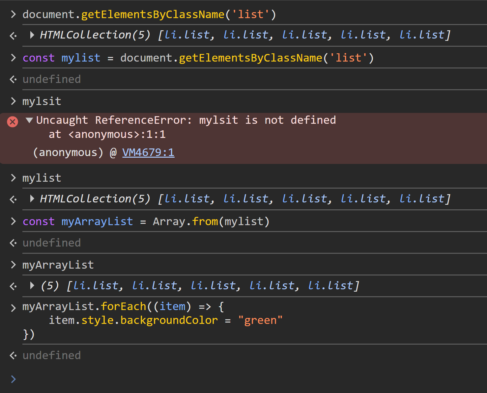
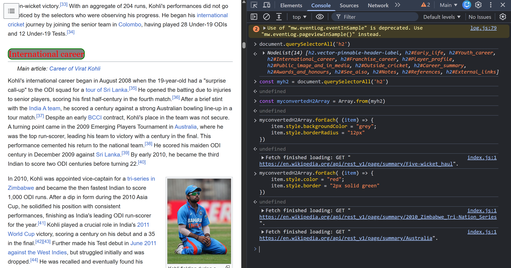
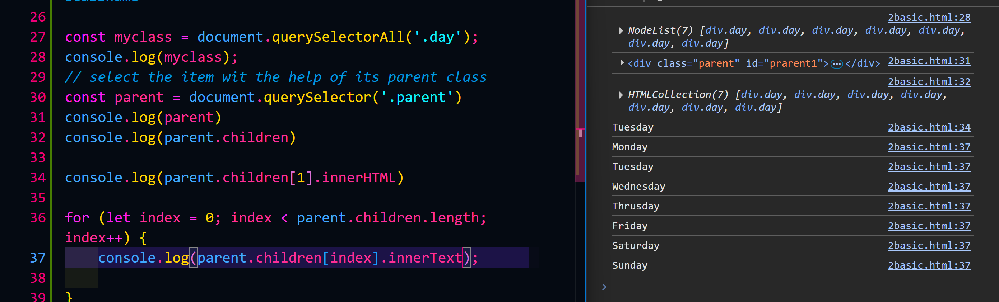
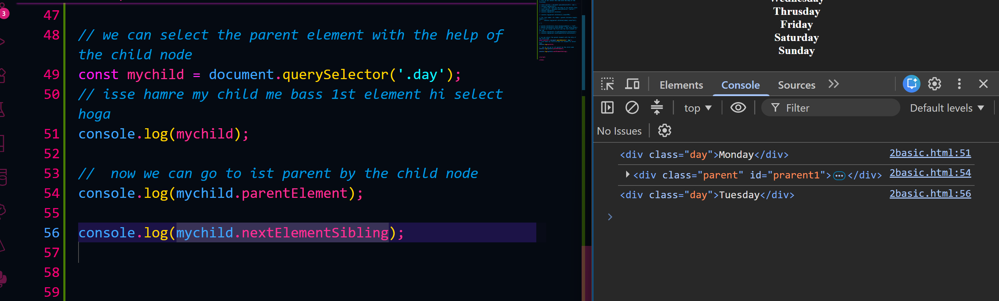
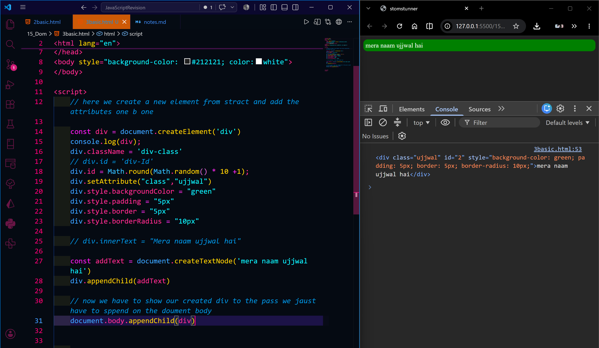

title.innerHTML
'Dom Learning hello this is a span tag'
title.textContent
'Dom Learning hello this is a span tag'
title.innerHTML
'Dom Learning hello this is a span tag'
title.textContent
'Dom Learning hello this is a span tag'  

const myul = document.querySelectorAll('ul')
undefined
    myul.forEach( function (item) {})
undefined
    myul.forEach( function (item) {
        item.style.backgroundColor = "green"
    })
undefined
myul.forEach( (item) => {
    item.backgroundColor = "grey"
}  )
undefined
myul.forEach( (i) => {
    i.backgroundColor = "grey"
}  )
undefined
myul.forEach( (i) => {
    i.backgroundColor = "grey";
}  )
undefined
myul.forEach( (i) => {
    i.style.backgroundColor = "grey";
}  )
undefined

forEach loop on the node list

how to selecet the item by their classname and how to convert the htmlcollection ot array and how to then apply for each loop

here i change the innerText and the css property of wikipidia page b using the queyseletorall

use of the parent adn children relation  and how to access all the item one by one

we can go to the child to the parent 

now we are creating a element from skratch and app to page
