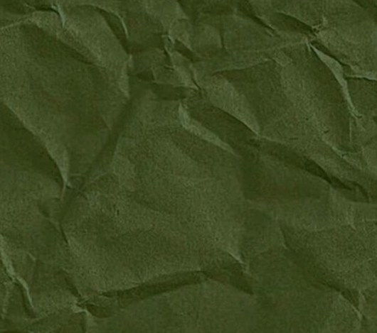
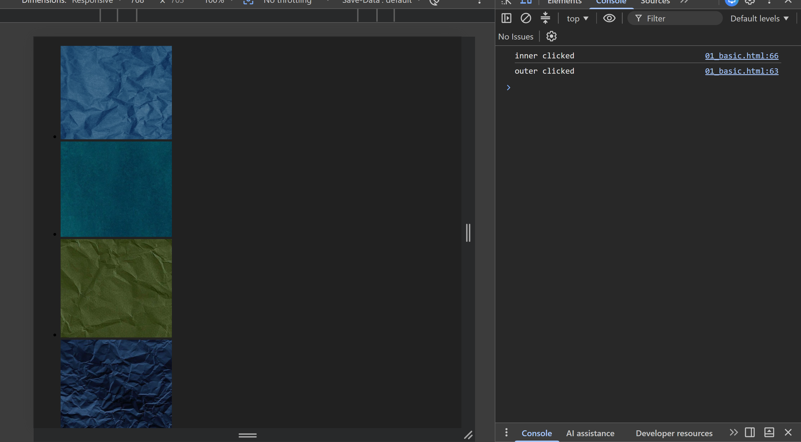

## bubling (hamra pahle inner wla code run ho rha hai ten hamara outer chal raha hai)
** jabki hamara inner code ander hai outer ke 
# when we use the false for proporgation

``` html

<!DOCTYPE html>
<html lang="en">
<head>
    <meta charset="UTF-8">
    <meta name="viewport" content="width=device-width, initial-scale=1.0">
    <title>Document</title>
</head>
<body style="background-color: #212121;">
    <div class="container">
        <ul class="main-container">
            <li></li>
            <li></li>
            <li></li>
            <li></li>
            <li><a style="color:rgb(8, 108, 196);"  href="https://google.com" id="google">Google</a></li>
        </ul>
        
    </div>
</body>
<script>
    // lets study ki event bubbling kya hota hai aur event proporgation kya hota hai 
    // lets take the class of the outer lass main-container
    // jiske ander hi hamra sara image hai
    document.querySelector('.main-container').addEventListener('click', function(event){
        console.log('outer clicked');
    }, false)
    document.querySelector('#kai').addEventListener('click', function(event){
        console.log('inner clicked');
    }, false)
</script>
</html>
```
